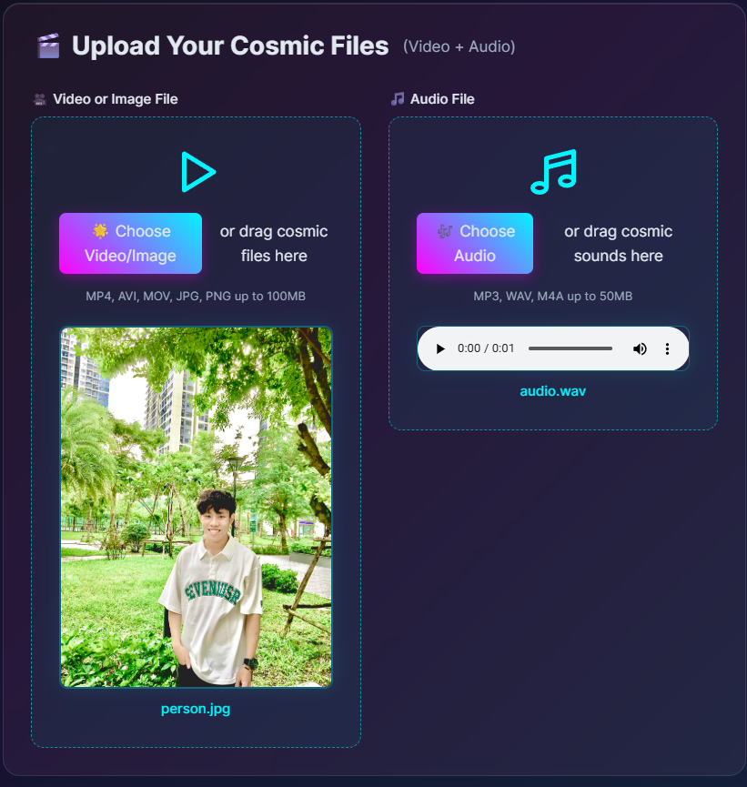
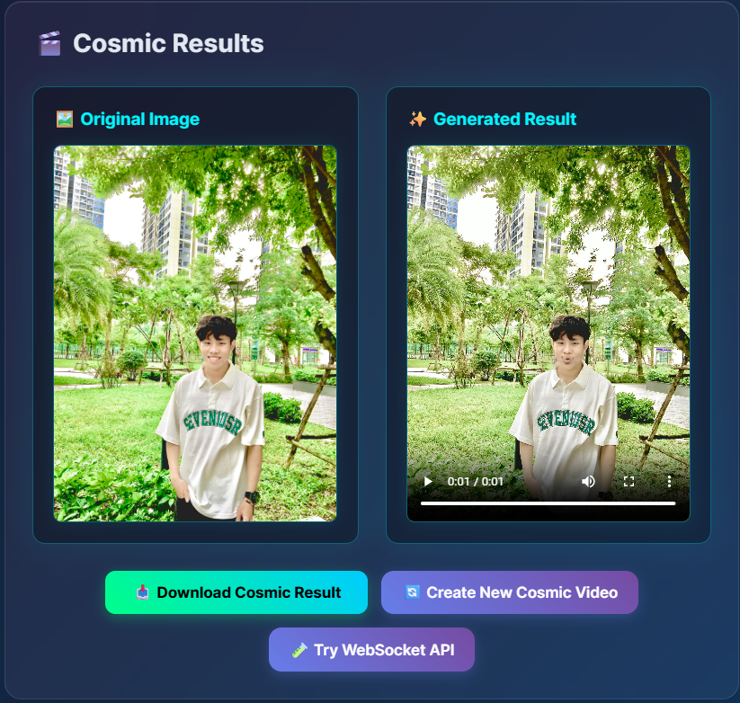

<div align="center">
  
  
  # ⭐ ILLUMINUS Wav2Lip
  
  ## Real-Time AI-Powered Lip Synchronization Platform
  
  [](https://opensource.org/licenses/Apache-2.0)
  [](https://www.docker.com/)
  [](https://developer.nvidia.com/cuda-zone)
  [](https://github.com/Zeres-Engel/ILLUMINUS)
  
  **Advanced AI-powered lip synchronization with cosmic-themed UI, automatic model download, and real-time WebSocket processing.**

  ### 🌐 **[✨ Try Live Demo ✨](http://illuminusw2l.io.vn/)**
</div>

---

## 🌟 Features

- 🚀 **GPU Acceleration**: CUDA support for up to 28× faster processing
- 🎯 **Smart Face Detection**: S3FD detection with automatic optimization
- ⚡ **Real-time WebSocket API**: Live progress updates and communication
- 🎨 **Cosmic Web Interface**: Beautiful UI with particle effects
- 🤖 **Dual AI Models**: Original (139MB) and Compressed (5MB) models
- 🔥 **Auto-Download**: AI models download automatically on first use
- 🐳 **Docker Ready**: One-command deployment
- 📱 **Responsive Design**: Works on all devices

---

## 🚀 Quick Start (Docker - Recommended)

### Prerequisites
- **Docker & Docker Compose**
- **NVIDIA Docker** (optional, for GPU acceleration)

### 1. Clone & Run
```bash
git clone https://github.com/Zeres-Engel/ILLUMINUS.git
cd ILLUMINUS
docker-compose up
```

### 2. Access Application
```bash
# Open browser
http://localhost:8000

# ✅ Models download automatically on first use!
```

### 3. GPU Support (Optional)
```bash
# For NVIDIA GPU acceleration
docker-compose -f docker-compose.gpu.yml up
```

---

## 🎬 How to Use

### Step 1: Upload Your Files


1. **📹 Upload Video/Image**: Drag & drop or click to select
   - Supports: MP4, AVI, MOV (video) | JPG, PNG (image)
2. **🎵 Upload Audio**: Add your audio file
   - Supports: MP3, WAV, M4A
3. **⚙️ Choose Model**: 
   - **Compressed** (5MB) - Fast, real-time
   - **Original** (139MB) - Best quality

### Step 2: Processing
- ✅ Files validate automatically
- 🚀 Real-time progress updates via WebSocket
- 📊 Live FPS and frame count display

### Step 3: Get Your Result


- 🎥 **Preview**: Watch your lip-sync video
- 📥 **Download**: Get the final MP4 file
- 📊 **Stats**: Processing time and performance metrics

### Video Demo


---

## 🐳 Docker Configuration

### Basic Setup (CPU Only)
```yaml
# docker-compose.yml
version: '3.8'
services:
  wav2lip-app:
    build: .
    ports:
      - "8000:8000"
    volumes:
      - ./data:/app/data
```

### GPU Setup (NVIDIA)
```yaml
# docker-compose.gpu.yml  
version: '3.8'
services:
  wav2lip-app:
    build: .
    ports:
      - "8000:8000"
    volumes:
      - ./data:/app/data
    deploy:
      resources:
        reservations:
          devices:
            - driver: nvidia
              count: 1
              capabilities: [gpu]
```

---

## ⚡ WebSocket API

### Connection
```javascript
const ws = new WebSocket('ws://localhost:8000/ws/lip-sync');
```

### Send Processing Request
```javascript
ws.send(JSON.stringify({
  type: 'process',
  audio_base64: audioBase64String,
  image_base64: imageBase64String,
  options: {
    model_type: 'nota_wav2lip', // or 'wav2lip'
    device: 'auto'
  }
}));
```

### Receive Updates
```javascript
ws.onmessage = function(event) {
  const data = JSON.parse(event.data);
  
  if (data.type === 'progress') {
    console.log(`Progress: ${data.percentage}%`);
  }
  
  if (data.type === 'result') {
    // data.video_base64 contains result video
    downloadVideo(data.video_base64);
  }
};
```

---

## 🤖 AI Models

### Automatic Download (Default)
- ✅ **Smart**: Downloads only missing models
- ✅ **Fast**: Automatic verification and retry
- ✅ **Zero Setup**: Just start the application!

### Manual Download (Optional)
If you prefer manual download:

**Face Detection (86MB)**: [Download S3FD](https://www.adrianbulat.com/downloads/python-fan/s3fd-619a316812.pth)
- Save to: `data/checkpoints/face_detection/s3fd-619a316812.pth`

**Wav2Lip Original (139MB)**: [Download Original](https://netspresso-huggingface-demo-checkpoint.s3.us-east-2.amazonaws.com/compressed-wav2lip/lrs3-wav2lip.pth)
- Save to: `data/checkpoints/wav2lip/lrs3-wav2lip.pth`

**Wav2Lip Compressed (5MB)**: [Download Compressed](https://netspresso-huggingface-demo-checkpoint.s3.us-east-2.amazonaws.com/compressed-wav2lip/lrs3-nota-wav2lip.pth)
- Save to: `data/checkpoints/wav2lip/lrs3-nota-wav2lip.pth`

---

## 🔧 Configuration

### Environment Variables
```bash
# GPU settings
CUDA_VISIBLE_DEVICES=0

# Model settings  
DEFAULT_MODEL=nota_wav2lip
DEFAULT_DEVICE=auto

# Server settings
HOST=0.0.0.0
PORT=8000
```

### API Endpoints
- **Main UI**: `http://localhost:8000/`
- **WebSocket**: `ws://localhost:8000/ws/lip-sync`
- **Health Check**: `http://localhost:8000/health`
- **Model Status**: `http://localhost:8000/checkpoints/status`

---

## 🛠️ Troubleshooting

### Docker Issues
```bash
# Rebuild container
docker-compose down
docker-compose build --no-cache
docker-compose up

# Check logs
docker-compose logs wav2lip-app
```

### GPU Not Detected
```bash
# Check NVIDIA Docker
docker run --gpus all nvidia/cuda:11.8-runtime-ubuntu20.04 nvidia-smi

# Install NVIDIA Container Toolkit if needed
```

### Models Not Downloading
```bash
# Force download
curl -X POST http://localhost:8000/checkpoints/auto-setup

# Check status
curl http://localhost:8000/checkpoints/status
```

### Out of Memory
```bash
# Reduce batch sizes via environment
FACE_DET_BATCH_SIZE=8
WAV2LIP_BATCH_SIZE=64
```

---

## 🤝 Contributing

1. Fork the repository
2. Create your feature branch (`git checkout -b feature/amazing-feature`)
3. Commit changes (`git commit -m 'Add amazing feature'`)
4. Push to branch (`git push origin feature/amazing-feature`)
5. Open a Pull Request

---

## 📄 License

Licensed under the **Apache License 2.0** - see [LICENSE](LICENSE) for details.

---

## 🙏 Acknowledgments

- **[Rudrabha Mukhopadhyay](https://github.com/Rudrabha/Wav2Lip)** - Original Wav2Lip research
- **[Adrian Bulat](https://github.com/1adrianb/face-alignment)** - Face alignment libraries
- **PyTorch Team** - Deep learning framework
- **FastAPI Team** - Modern web framework

---

## 📞 Support

- **📧 Email**: [ngpthanh15@gmail.com](mailto:ngpthanh15@gmail.com)
- **🌐 GitHub**: [@Zeres-Engel](https://github.com/Zeres-Engel)
- **🐛 Issues**: [GitHub Issues](https://github.com/Zeres-Engel/ILLUMINUS/issues)

---

<div align="center">

**Made with ❤️ by [Andrew](https://github.com/Zeres-Engel)**

*Transforming AI-powered video generation, one cosmic lip-sync at a time* ✨

### 🌟 **[Experience ILLUMINUS Live →](http://illuminusw2l.io.vn/)**

</div>
